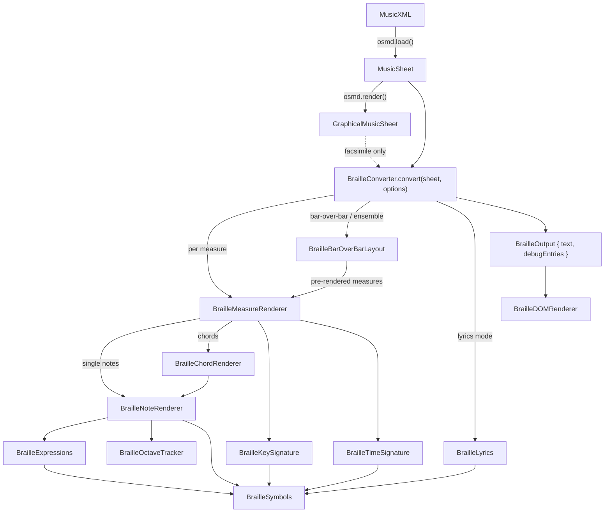
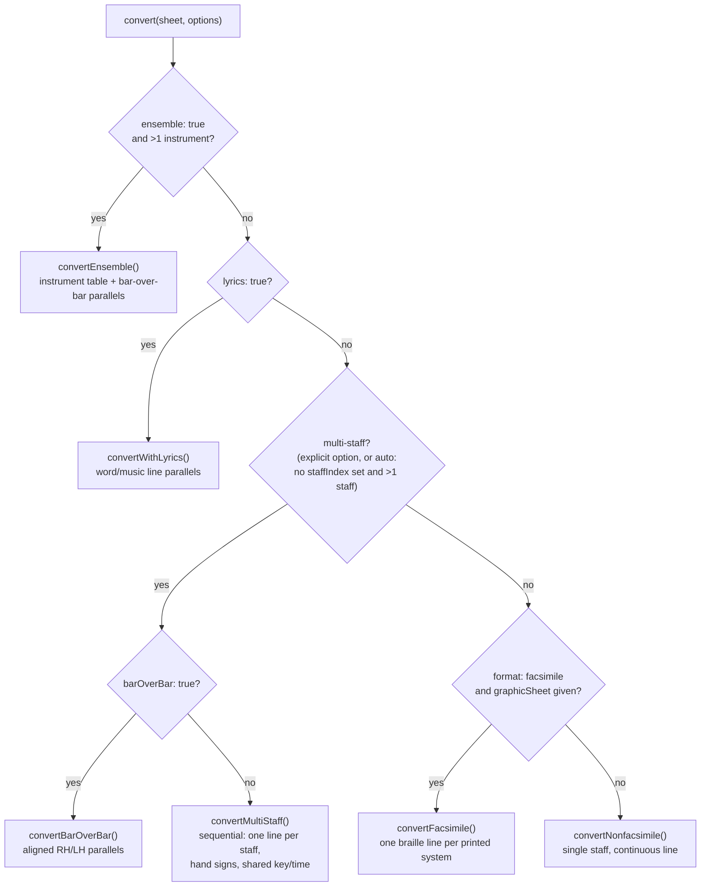

# OSMD Braille Module — Developer Documentation

This document describes the **braille music module** of OpenSheetMusicDisplay (OSMD): what it
is, whom it helps, and how it works — from a bird's-eye view down to the software structure.
It is written for third-party developers who want to **use** the module in their own
applications or **continue its development**. If you want to *use* the braille feature as an
end user (demo, screen reader, braille display — no programming), read the
[user guide](UserGuide.md) instead.

> Development of this module was supported by a **netidee** grant
> (Internet Foundation Austria). Progress history, screenshots, and design discussions are
> tracked in [private issue #158](https://github.com/phonicscore/osmd-private/issues/158)
> (branch `feat/braille`).

**Contents**

1. [What is it?](#1-what-is-it)
2. [Who is it for, and how does it help?](#2-who-is-it-for-and-how-does-it-help)
3. [How does it work? — Overview](#3-how-does-it-work--overview)
   - [Quick start](#31-quick-start)
   - [A crash course in braille music notation](#32-a-crash-course-in-braille-music-notation)
   - [Architecture overview](#33-architecture-overview)
   - [Output modes and how they are selected](#34-output-modes-and-how-they-are-selected)
4. [How does it work? — Detailed system concept](#4-how-does-it-work--detailed-system-concept)
   - [The rendering pipeline](#41-the-rendering-pipeline)
   - [The layout engines](#42-the-layout-engines)
   - [Unicode encoding and code conventions](#43-unicode-encoding-and-code-conventions)
   - [Public API reference](#44-public-api-reference)
   - [The debug/translation system](#45-the-debugtranslation-system)
   - [Demo integration](#46-demo-integration)
   - [Testing](#47-testing)
   - [Extending the module](#48-extending-the-module)
   - [Known limitations](#49-known-limitations)
   - [References](#410-references)

---

## 1. What is it?

The braille module converts a score loaded by OSMD (from MusicXML) into **braille music
notation**, output as a plain string of Unicode braille characters (U+2800–U+283F). It is a
self-contained, optional add-on in `src/Plugins/Braille/` — off by default, with zero overhead
for applications that do not use it.

The transcription rules follow the **Music Braille Code 2015** (Braille Authority of North
America, BANA), the current standard for braille music in North America and the reference
used throughout the code (comments cite it as `Par. X.Y` / `Table N`). The
*New International Manual of Braille Music Notation* (Krolick, 1996) serves as a
complementary reference.

### Supported notation and formats

| Area | Supported |
|---|---|
| Notes & rests | Pitches C–B, durations whole–128th (incl. dotted), rests, octave marks with full contextual rules |
| Signatures | Key signatures, time signatures (rendered on change), accidentals (♯ ♭ ♮ 𝄪 𝄫) |
| Chords | Interval notation with clef-dependent reading direction, accidentals on intervals, compound intervals |
| Multiple voices | Full-measure in-accord (voice separation within one staff) |
| Expression | Dynamics (pp–ff, sfz, …), crescendo/diminuendo hairpins, articulations (staccato, accent, tenuto, marcato, …), fermata, ornaments (trill, turn, mordent, …) |
| Structure | Ties, slurs (short and bracket), repeat barlines, voltas, Segno/Coda, D.C./D.S. al Fine/Coda |
| Keyboard music | Hand signs, sequential multi-staff output, **bar-over-bar** format with vertical alignment, guide dots, run-over lines |
| Ensemble scores | Instrument abbreviations, instrument list table, condensed score (resting parts omitted), per-part key signatures, measure-number lines |
| Vocal music | Lyrics as word-line/music-line parallels, syllable joining, melisma slurs, multi-verse output |
| Facsimile mode | Clef signs, ottava brackets (8va/8vb/15ma/15mb), line breaks matching the printed systems |

Not yet supported: see [§4.9](#49-known-limitations).

### What it is *not*

Professional braille transcription includes editorial judgment (e.g. choosing part-measure
in-accord divisions, pagination, layout optimizations for readability) that is deliberately
out of scope — the standard itself treats several of these as transcriber's choices. The
module produces a **correct, readable, automatic transcription**; a human transcriber could
still improve ergonomics for complex scores.

---

## 2. Who is it for, and how does it help?

**Blind and visually impaired musicians** (via applications built on OSMD). Braille music
literacy depends on access to scores, yet only a small fraction of printed music is available
in braille, and manual transcription is slow and scarce. This module turns *any* MusicXML
score — the de-facto interchange format supported by virtually all notation software — into
braille music instantly. The output can be read on screen, sent to a refreshable braille
display via a screen reader, or embossed after conversion to ASCII braille.

**Developers of music applications.** Anyone embedding OSMD (education platforms, choir
apps, sheet music viewers) can add braille output with a few lines of code
([§3.1](#31-quick-start)) and no changes to their rendering pipeline. The module reads the
already-parsed data model; it does not interfere with visual rendering.

**Website developers using WordPress.** The free
[OSMD WordPress plugin](https://wordpress.org/plugins/opensheetmusicdisplay/) ships this
braille output ready-made: scores embedded on a WordPress site can offer their braille
version without writing any code against the API.

**Music educators and braille transcribers.** The built-in debug/translation view
([§4.5](#45-the-debugtranslation-system)) annotates every braille sign with its musical
meaning ("octave 4", "quarter note D4", "staccato"). This makes the output verifiable by
sighted teachers who do not read braille music, and usable as teaching material for braille
music notation itself.

**OSMD contributors and researchers.** The module doubles as a machine-readable, tested
implementation of the Music Braille Code rules — each rule is implemented in one place and
cross-referenced to the standard's paragraph numbers.

---

## 3. How does it work? — Overview

### 3.1 Quick start

The module is exported from the main OSMD package entry point. The minimal path is:
load a score, then hand `osmd.Sheet` to a `BrailleConverter`.

```typescript
import { OpenSheetMusicDisplay, BrailleConverter } from "opensheetmusicdisplay";

const osmd = new OpenSheetMusicDisplay(containerElement);
await osmd.load(musicXmlStringOrUrl);   // parsing is enough — render() is NOT required

const converter = new BrailleConverter();
const output = converter.convert(osmd.Sheet);

console.log(output.text);         // Unicode braille string, e.g. "⠐⠹⠱⠫⠻ ⠳⠪⠺⠹"
console.log(output.debugEntries); // per-sign translations (see §4.5)
```

With options (all optional, see [§4.4](#44-public-api-reference) for the full reference):

```typescript
const output = converter.convert(osmd.Sheet, {
    barOverBar: true,     // keyboard bar-over-bar format (vertically aligned RH/LH lines)
    lineWidth: 40,        // cells per braille line (default 40 = standard display width)
    // ensemble: true,    // multi-instrument score with abbreviation prefixes
    // lyrics: true,      // vocal music: word line + music line parallels
    // staffIndex: 0,     // render one specific staff only (disables multi-staff auto-detect)
});
```

Facsimile mode additionally needs the rendered layout, so it requires `render()` first:

```typescript
await osmd.load(xml);
osmd.render();
const output = converter.convert(osmd.Sheet, {
    format: "facsimile",
    graphicSheet: osmd.GraphicSheet,   // system layout, available after render()
});
```

To display the result, either use the ready-made DOM helper:

```typescript
import { BrailleDOMRenderer } from "opensheetmusicdisplay";
document.body.appendChild(new BrailleDOMRenderer().render(output, /*debugMode*/ true));
```

…or place `output.text` in your own element. For the aligned formats (bar-over-bar,
ensemble, lyrics) use a monospace font and `white-space: pre`, since alignment is done with
padding characters. On an actual refreshable braille display every cell has equal width, so
alignment is exact by construction; in browsers it is only as good as the font's glyph
metrics (see [§4.6](#46-demo-integration)).

To try it interactively: `npm start`, open the demo, and load any `test_Braille_*` sample —
the braille output and its translation table appear next to the score.

Not writing JavaScript at all? The free
[OSMD WordPress plugin](https://wordpress.org/plugins/opensheetmusicdisplay/) ships the
same braille output ready-made for WordPress sites.

### 3.2 A crash course in braille music notation

You cannot follow the code without a few domain concepts. Braille music is **not** a
character-by-character translation of the printed page — it is a distinct, sequential
notation with its own grammar. The five ideas below drive most of the module's design.

**1. One cell, six dots.** Each braille cell has 6 dot positions, numbered 1–2–3 down the
left column and 4–5–6 down the right. Unicode encodes all 64 combinations in the block
U+2800–U+283F, where each dot is one bit (see [§4.3](#43-unicode-encoding-and-code-conventions)).

**2. A note character = pitch + duration in one cell.** The upper four dots (1, 2, 4, 5)
encode the pitch letter (C–B); the lower two dots (3, 6) encode the duration class:

|  | dots 3+6 | dot 3 | dot 6 | (none) |
|---|---|---|---|---|
| | whole / 16th | half / 32nd | quarter / 64th | eighth / 128th |
| C (dots 1,4,5) | ⠽ | ⠝ | ⠹ | ⠙ |
| D (dots 1,5) | ⠵ | ⠕ | ⠱ | ⠑ |
| … | | | | |

Note that each character means *two* durations (whole notes and 16ths share a character, and
so on) — the reader disambiguates from the time signature and beat context (MBC 2015
Par. 2.1). This is why the code models duration as a 4-value `BrailleDurationGroup` rather
than the full duration.

**3. Octave marks instead of clefs and staff positions.** Register is given by a prefix sign
for octaves 1–7 (octave 4 contains middle C): ⠈ ⠘ ⠸ ⠐ ⠨ ⠰ ⠠. Crucially, the mark is only
written when the reader could not infer the octave from melodic context (MBC 2015
Par. 3.2.2): never for steps smaller than a fourth, always for leaps larger than a fifth,
and for fourths/fifths only when the octave changes. Getting this rule right requires
tracking the previous pitch across the entire piece — that is `BrailleOctaveTracker`'s job,
and the reason state threads through the whole pipeline.

A complete, verifiable example — a C major scale in quarter notes over two 4/4 measures
(this is exactly what the module produces; a barline is simply a **space** in braille music):

```
⠐⠹⠱⠫⠻ ⠳⠪⠺⠹
```

| Sign | Meaning |
|---|---|
| ⠐ | octave mark 4 (first note of a piece always gets one) |
| ⠹ ⠱ ⠫ ⠻ | quarter notes C4 D4 E4 F4 (no further octave marks — all steps) |
| *(space)* | barline |
| ⠳ ⠪ ⠺ ⠹ | quarter notes G4 A4 B4 C5 (C5 needs no mark: a second step from B4) |

**4. Chords are one written note plus intervals.** Instead of stacking noteheads, braille
writes one note of the chord in full and the remaining notes as *interval signs* (2nd–octave)
relative to it. Which note is written out depends on the clef: treble/C clef → the highest
note, reading intervals downward; bass clef → the lowest note, reading upward (in ensemble
scores all parts read upward, MBC 2015 Par. 33.4.2). Simultaneous *voices* within a staff use
a different mechanism, the full-measure **in-accord** sign ⠣⠜: each voice's measure is
written out in full, joined by the sign — the reader knows they sound together.

**5. There are two transcription philosophies.** A **nonfacsimile** transcription (the
default) is the standard braille music format: a continuous stream of measures, omitting
print-layout artifacts (clefs, ottava brackets, system breaks) because octave marks already
carry register information. A **facsimile** transcription mirrors the printed page — one
braille line per printed system, clef signs, ottava brackets — useful when a braille reader
works alongside sighted musicians using the same printed edition (MBC 2015 §1.1).

On top of these, the standard defines *layout formats* for multi-part music, all
implemented here: hand signs ⠨⠜/⠸⠜ for keyboard music, the **bar-over-bar** parallel format
(RH and LH lines vertically aligned, measure by measure), ensemble scores with instrument
abbreviation prefixes, and vocal parallels of a literary-braille word line above the music
line.

### 3.3 Architecture overview

Design principles (established at project start and held throughout):

1. **Read-only.** The module only reads OSMD's parsed data model (`MusicSheet` and, for
   facsimile, `GraphicalMusicSheet`). It never mutates existing objects.
2. **Parallel output path.** Completely independent from the VexFlow visual rendering; can
   be re-run with different options without re-loading or re-rendering the score.
3. **Modular.** One braille concept per file; renderers are stateless classes/functions.
4. **Explicit state.** Everything that must persist across measures lives in one
   `BrailleState` object passed through the pipeline — this keeps the renderers testable
   and makes the octave/slur/clef bookkeeping visible in signatures.

#### Module structure

```
src/Plugins/Braille/
  index.ts                   Public re-exports (also re-exported from the OSMD package root)
  BrailleConverter.ts        Main orchestrator: MusicSheet → BrailleOutput; mode selection
  BrailleMeasureRenderer.ts  One SourceMeasure → braille (voices, in-accord, dynamics,
                             repeats, voltas, navigation signs; owns BrailleState definition)
  BrailleNoteRenderer.ts     One Note → braille (sign ordering around a note)
  BrailleChordRenderer.ts    Chord → written note + interval signs
  BrailleOctaveTracker.ts    Octave-mark decision rules (MBC 2015 Par. 3.2)
  BrailleKeySignature.ts     Key signature rendering
  BrailleTimeSignature.ts    Time signature rendering
  BrailleExpressions.ts      Dynamics, articulations, ornaments, fermata mappings
  BrailleSymbols.ts          All braille character constants, lookup tables, text-to-braille
  BrailleBarOverBar.ts       Layout engine: bar-over-bar + ensemble formats (string layout only)
  BrailleLyrics.ts           Lyrics extraction: syllables, melisma detection, verse collection
  BrailleDOMRenderer.ts      Optional DOM output helper (braille text + debug view)
```

#### Data flow



The OSMD data model chain the module traverses (for each staff):

```
MusicSheet.SourceMeasures[]                          (SourceMeasure)
  → .VerticalSourceStaffEntryContainers[]            (one per beat position)
    → .StaffEntries[staffIndex]                      (SourceStaffEntry)
      → .VoiceEntries[]                              (VoiceEntry — one per voice)
        → .Notes[]                                   (Note: Pitch, NoteTypeXml, DotsXml, …)
```

The shared helper `forEachVoiceEntryInMeasure()` (exported from `BrailleMeasureRenderer.ts`)
encapsulates this traversal including all null guards; use it for any new whole-measure
analysis pass.

An important octave convention when reading the code: OSMD stores octaves internally as
`XML octave − 3` (so middle C is `Pitch.Octave === 1`), while braille uses standard octave
numbers (middle C = octave 4). Conversion is always
`brailleOctave = Pitch.Octave + Pitch.OctaveXmlDifference` (= +3).

### 3.4 Output modes and how they are selected

`BrailleConverter.convert()` picks exactly one conversion path from the options, in this
precedence order:



Two deliberate design decisions are visible here:

- **Multi-staff is auto-detected, ensemble and lyrics are not.** A piano score should render
  both hands by default ("render the whole score" is OSMD's guiding default). But ensemble
  mode cannot be auto-detected because MusicXML frequently encodes piano as two separate
  `<score-part>` elements — auto-detection would misclassify keyboard music. Lyrics mode is
  explicit for the same reason: many instrumental test scores carry stray lyric metadata.
- **Facsimile degrades gracefully.** If `format: "facsimile"` is requested without a
  `graphicSheet`, the converter logs a warning and falls back to nonfacsimile. The full
  facsimile treatment (line = printed system) applies to the single-staff path; in the other
  modes the facsimile flag still enables facsimile-only signs (clef signs, ottava brackets)
  within the measure renderer, but line breaking stays mode-specific.

---

## 4. How does it work? — Detailed system concept

### 4.1 The rendering pipeline

#### BrailleState — the only mutable state

All context that crosses measure boundaries lives in `BrailleState`
(`BrailleMeasureRenderer.ts`):

| Field | Purpose |
|---|---|
| `octaveTracker` | Previous pitch + first-note flag → octave mark decisions (Par. 3.2) |
| `currentKey`, `currentRhythm` | Active key/time signature — rendered only on change |
| `currentClef` | Active clef → chord interval direction; updated by clef instructions |
| `facsimile` | Enables facsimile-only signs (clefs, ottavas) |
| `hadInAccord` | Previous measure had in-accord → force octave mark (Par. 3.2.1) |
| `activeSlurs` | Slurs currently open — OSMD stores slur refs only on start/end notes, so intermediate notes are detected via this set |
| `slurLengths` | Pre-computed note count per slur → choose short vs. bracket slur (Par. 13.3) |
| `activeOctaveShift` | Active ottava bracket (facsimile: notes are written at staff pitch) |
| `ensembleMode` | Force upward interval reading (Par. 33.4.2) |
| `melismaSlurNotes` | VoiceEntries needing a syllabic slur ⠉ in lyrics mode (Par. 35.2) |

Fresh state = fresh line semantics: several formats exploit this. Each staff in multi-staff
mode gets its own `BrailleState`, which automatically yields the mandatory octave mark after
a hand sign — no special-case code needed. Similarly, key/time suppression on the left-hand
line is done by *pre-initializing* `currentKey`/`currentRhythm` in the LH state, so the
renderer's ordinary "has it changed?" check skips them.

One pre-pass runs before any rendering: `BrailleConverter.computeSlurLengths()` walks the
whole score counting notes per slur, because the *opening* bracket-slur sign ⠰⠃ must be
emitted before the first note — at which point a single forward pass could not yet know the
slur's length.

#### Measure rendering order

`BrailleMeasureRenderer.render()` emits, in order:

1. **Preamble** — clef sign (facsimile only, on change), key signature (on change), time
   signature (on change). The clef→key→time order mirrors print convention.
2. **Structural start signs** — forward repeat ⠣⠶, volta numbers, Segno ⠬ (each forces an
   octave mark on the following note, Par. 17.1 / 20.1).
3. **Voice entries in beat order.** Dynamics and ottava events are collected from
   `SourceMeasure.StaffLinkedExpressions` into timestamp-sorted event lists and interleaved
   with the notes at matching timestamps (dynamics are word-sign expressions like ⠜⠏ and
   also force an octave mark, Par. 22.3(e)). Single notes go to `BrailleNoteRenderer`,
   multi-note entries to `BrailleChordRenderer`.
4. **Multiple voices** — if the staff has more than one voice in this measure, each voice's
   measure is rendered separately and joined with the full-measure in-accord sign ⠣⠜;
   voices are ordered by clef (treble: highest first, bass: lowest first).
5. **Structural end signs** — backward repeat ⠣⠆, D.C./D.S./Fine/To-Coda word expressions.

#### Sign ordering around a single note

The Music Braille Code prescribes a strict ordering, implemented in
`BrailleNoteRenderer.render()`:

```
[dynamics*] [articulations] [ornaments] [accidental] [octave mark] [NOTE] [dots] [fermata] [tie] [slur*]
```

(\* dynamics are emitted at measure level before the note; the slur sign is appended by the
measure renderer, which knows the phrase context.) Articulations and ornaments precede the
accidental/octave group (Par. 22.1, 16.3); the augmentation dot ⠄ follows immediately; the
fermata follows the dots (Par. 22.2); a tie sign ⠈⠉ (chords: ⠨⠉) is written only on the
tie's start note (Par. 10.1). In nonfacsimile output a slur concurrent with a tie is omitted
(Par. 13.5).

Duration resolution prefers `Note.NoteTypeXml` (the notated type) and falls back to the
`Note.Length` fraction — important because braille needs the *notated* value class, not the
effective duration (e.g. under tuplets).

#### The octave tracker

`BrailleOctaveTracker` implements Par. 3.2 exactly (all rules unit-tested):

- first note of a piece/line/section → always mark;
- melodic step < fourth → never mark;
- leap > fifth → always mark;
- fourth or fifth → mark only if the octave number changes.

Intervals are counted **diatonically** (letter distance, not semitones). `reset()` is called
wherever the standard demands a fresh octave mark: new braille line/system, after hand
signs, in-accord signs, repeat/volta/navigation signs, dynamics, clef signs, and at every
measure start in bar-over-bar (Par. 29.3(a) — measure-by-measure navigation for the reader).
Note the tracker follows only *written* chord notes; interval notes are relative and do not
change the octave context.

#### Chords

`BrailleChordRenderer` sorts the `VoiceEntry.Notes` by pitch, picks the written note by
clef (G/C: highest, F: lowest, `forceUpward` → F behavior), renders it through the normal
note renderer (so articulations/ornaments attach to it), then appends per interval note:
`[octave mark if compound] [accidental] [interval sign]`. Interval signs (Table 9) reduce
compound intervals to their simple class (9th → 2nd sign preceded by the note's octave
mark).

### 4.2 The layout engines

The formats beyond a single line are pure **string-layout** problems, deliberately separated
from music rendering: `BrailleBarOverBarLayout` (in `BrailleBarOverBar.ts`) arranges
*pre-rendered* per-measure braille strings; it never interprets music itself. This split
keeps both halves independently testable.

#### Bar-over-bar (keyboard music, MBC 2015 Ch. 28 + Par. 29.3)

```
        ⠼⠙⠲            ← music heading: key + time, centered (Par. 1.7)
⟨num⟩ ⠨⠜⟨RH m1⟩ ⟨RH m2⟩ …   ← parallel: right-hand line
⟨num⟩ ⠸⠜⟨LH m1⟩ ⟨LH m2⟩ …   ←           left-hand line, measure starts aligned
```

- Measures are pre-rendered per staff with an octave-tracker reset per measure.
- **Greedy packing**: measures are added to a parallel while both lines fit `lineWidth`
  (default 40 cells — the standard braille display/page width).
- **Vertical alignment**: at each measure boundary the shorter line is padded; when the gap
  is ≥ `guideDotThreshold` (6) cells, at least `guideDotMinCount` (5) guide dots ⠄ are used
  instead of blank cells (Par. 29.3(i)).
- Measure numbers are written at the left margin without a number sign, right-aligned as a
  column (Par. 29.3(b)(c)).
- **Run-over lines** (Par. 28.1.2): if a single parallel line still exceeds `lineWidth`, it
  is split at the last blank cell that fits and continued on the next line, indented two
  cells past the music start column. Splits happen only *between* measures — braille signs
  within a measure are context-coupled (octave marks, interval signs) and must not be
  separated. A lone measure longer than the line is left to overflow, matching transcriber
  practice.

#### Ensemble scores (MBC 2015 Ch. 33)

Built on the same parallel machinery with these additions:

- An **instrument list table** (Par. 33.2) precedes the music: full names (literary braille
  via `textToBraille()`) in the left column, abbreviations right, gaps ≥ 3 cells filled with
  dot-5 guide dots.
- Each parallel line is prefixed by the instrument's abbreviation
  (`Instrument.PartAbbreviation`, falling back to the name) + dot-3 terminator; music starts
  at a common column = longest abbreviation + 1 blank cell.
- Measure numbers go in a **free line above** each parallel (Par. 33.4.6).
- **Condensed score** (Par. 33.1): a staff that contains only rests for the entire measure
  range of a parallel is omitted from that parallel; the abbreviation column width is
  recomputed per parallel from the active staves only.
- **Per-part key signatures** (Par. 33.4.1): if instruments carry different key signatures
  (transposing instruments), the key is dropped from the heading and appended to each
  abbreviation instead.
- All chord intervals read upward regardless of clef (Par. 33.4.2), via
  `BrailleState.ensembleMode`.

#### Lyrics (MBC 2015 Sec. 35)

`convertWithLyrics()` builds alternating parallels of a **word line** (literary braille,
cell 1) and a **music line** (indented 2 cells):

1. `collectVerseNumbers()` scans the score; the first verse is paired with the music.
2. `buildMelismaSlurSet()` pre-collects VoiceEntries that continue a syllable (MusicXML
   `<extend>`), i.e. melisma notes — one syllable sung over several notes.
3. Measures are pre-rendered (octave reset per measure; key/time diverted to the heading).
4. `extractLyricsMeasure()` produces the word text per measure: print hyphens are dropped
   and syllables of one word concatenated (Par. 35.1.1a); melisma continuation notes get the
   syllabic slur ⠉ appended in the music line (Par. 35.2).
5. Greedy packing groups measures so that *both* the word and the music line fit.
6. Verses 2+ are appended after the music as continuous literary text, each introduced by
   a parenthesized verse number ⠷…⠾ (Par. 35.7).

There are no measure numbers in vocal music (Par. 35.9).

#### Facsimile

`convertFacsimile()` swaps the iteration order: instead of walking `SourceMeasures[]`
linearly, it walks the rendered layout
`GraphicalMusicSheet.MusicPages[] → MusicSystems[] → StaffLines[staffIndex].Measures[]`,
emitting one braille line per printed system (octave tracker reset at each system start).
Clefs come from `GraphicalMeasure.InitiallyActiveClef` — the authoritative source, since
OSMD stores mid-score clef changes on the *previous* measure's end instructions where a
per-measure renderer cannot reliably see them. Ottava brackets are collected like dynamics
(timestamp-interleaved events); while one is active, notes are written at *staff* pitch
(what the print shows) rather than sounding pitch, with the end marker ⠜⠄ after the last
affected note.

### 4.3 Unicode encoding and code conventions

Braille characters are composed with a bitmask, one bit per dot
(`BrailleSymbols.ts`):

```typescript
export const DOT1 = 0x01; export const DOT2 = 0x02; export const DOT3 = 0x04;
export const DOT4 = 0x08; export const DOT5 = 0x10; export const DOT6 = 0x20;

export function dotsToChar(dots: number): string {
    return String.fromCharCode(0x2800 | dots);   // U+2800 = blank braille cell
}

// example: a quarter-note G = pitch dots (1,2,5) + duration dot (6)
const gQuarter = dotsToChar(DOT1 | DOT2 | DOT5 | DOT6);   // ⠳
```

This is the reason for the one deliberate lint exception: the project-wide `no-bitwise`
ESLint rule is overridden for `src/Plugins/Braille/` (see `.eslintrc.js`) — dot composition
*is* bit arithmetic. A handy consequence: properties of a sign can be tested numerically,
e.g. `firstCharHasLowerDots()` checks `charCode & (DOT1 | DOT2 | DOT3)` to decide whether a
dot-3 separator is needed after a hand sign (Par. 29.2).

Every sign is a **named constant** (`BRAILLE_STACCATO`, `BRAILLE_FORWARD_REPEAT`, …) or a
small lookup function (`getNoteChar`, `getIntervalChar`, `getDynamicBraille`,
`getNavigationBraille`, …), each annotated with its dot numbers, Unicode code point, and the
MBC 2015 table/paragraph it was verified against. `textToBraille()` provides Grade 1
(uncontracted) literary braille for instrument names and lyrics.

Citation convention used in all comments: `Par. X.Y` and `Table N` refer to the
**Music Braille Code 2015**; section references `§X.Y` refer to its front matter.

### 4.4 Public API reference

Everything is exported via `src/Plugins/Braille/index.ts` and re-exported by the OSMD
package root (`import { … } from "opensheetmusicdisplay"`).

#### `BrailleConverter`

```typescript
class BrailleConverter {
    convert(musicSheet: MusicSheet, options?: BrailleOptions): BrailleOutput;
    static computeSlurLengths(measures: SourceMeasure[], staffIndex: number): Map<Slur, number>;
}
```

#### `BrailleOptions`

| Option | Type / default | Effect |
|---|---|---|
| `staffIndex` | `number` = `0` | Render one specific staff (0-based). Setting it explicitly disables multi-staff auto-detection. |
| `debugMode` | `boolean` = `true` | Populate `debugEntries` (per-sign translations). |
| `format` | `"nonfacsimile"` \| `"facsimile"` = `"nonfacsimile"` | Facsimile adds clefs, ottavas, and per-system line breaks (needs `graphicSheet`). |
| `graphicSheet` | `GraphicalMusicSheet` | Required for facsimile; take from `osmd.GraphicSheet` after `render()`. |
| `multiStaff` | `boolean`, auto | All staves with hand signs, one line per staff. Auto-enabled when the score has >1 staff and `staffIndex` was not set. |
| `barOverBar` | `boolean` = `false` | Within multi-staff: vertically aligned parallels instead of sequential lines. |
| `lineWidth` | `number` = `40` | Max cells per line for bar-over-bar / ensemble / lyrics packing. |
| `ensemble` | `boolean` = `false` | Multi-instrument format (abbreviation prefixes, instrument table, condensed score). Never auto-detected. |
| `lyrics` | `boolean` = `false` | Vocal format (word line + music line parallels, multi-verse). Explicit opt-in. |

#### `BrailleOutput`

```typescript
interface BrailleOutput {
    text: string;                       // the complete braille (may contain \n and padding)
    debugEntries: BrailleDebugEntry[];  // { braille, meaning, measureNumber } per sign
}
```

#### `BrailleDOMRenderer`

`render(output, debugMode?)` returns a ready `<div>` with the braille text in a `<pre>`
(ARIA-labelled) and, optionally, the translation view. Applications with their own UI can
ignore it and consume `output.text` directly — the demo does exactly that (see §4.6).

#### Lower-level building blocks

Useful when embedding or extending (all exported):

| Export | Module | Use |
|---|---|---|
| `dotsToChar`, `DOT1…DOT6`, all `BRAILLE_*` constants | `BrailleSymbols` | Compose/compare signs |
| `getNoteChar`, `getRestChar`, `getIntervalChar`, `getAccidentalChar`, `getClefBraille`, `getOttavaBraille`, `getNavigationBraille`, `getVoltaBraille`, `getDynamicBraille` | `BrailleSymbols` / `BrailleExpressions` | Symbol lookups |
| `textToBraille` | `BrailleSymbols` | Grade 1 literary braille for text |
| `renderKeySignature`, `renderTimeSignature` | `BrailleKeySignature/-TimeSignature` | Standalone signature rendering |
| `BrailleOctaveTracker` | `BrailleOctaveTracker` | Octave mark rules, diatonic interval math |
| `forEachVoiceEntryInMeasure` | `BrailleMeasureRenderer` | Safe data-model traversal |
| `BrailleBarOverBarLayout` | `BrailleBarOverBar` | Parallel layout, run-over splitting, headings, instrument table |
| `extractLyricsMeasure`, `buildMelismaSlurSet`, `collectVerseNumbers`, `extractFullVerse` | `BrailleLyrics` | Lyrics building blocks |

### 4.5 The debug/translation system

Every renderer returns, alongside the braille string, a list of
`{ braille, meaning }` pairs; the converter tags them with measure numbers. This serves
three audiences: **tests** assert against meanings without hardcoding layout; **sighted
developers/teachers** can read what each cell means; and **future features** (e.g. cursor
sync between braille and the visual score) can be built on the braille↔meaning↔measure
mapping. In the demo the entries are shown as a table under the braille output, and the most
recent result is exposed on the browser console as `window.brailleDebug`.

Example (start of the scale sample):

| Braille | Meaning | Measure |
|---|---|---|
| ⠐ | octave 4 | 1 |
| ⠹ | quarter/64th C4 | 1 |
| ⠱ | quarter/64th D4 | 1 |

### 4.6 Demo integration

The demo (`npm start`, source `demo/index.js` — search for `renderBraille`) converts the
loaded sheet after every load and whenever one of the braille checkboxes changes (facsimile,
bar-over-bar, ensemble, lyrics — all off by default so the standard output is what users see
first). No score re-render is needed for option changes. A fifth toggle, **"Show classical
score above braille"** (on by default), hides the visual score and — more importantly —
skips `render()` entirely for subsequently loaded scores: `load()` alone builds the data
model the converter reads, which makes large scores load much faster. Facsimile mode is the
exception: it reads the rendered `GraphicSheet`, so the demo renders (hidden via CSS, which
preserves the container width) whenever facsimile is active.

Points worth copying into your own integration:

- **Fonts:** the aligned formats are rendered with
  `Consolas / Courier New / DejaVu Sans Mono, monospace`, `white-space: pre`, and ligatures
  disabled. Browsers still don't guarantee perfectly uniform advance widths for braille
  glyphs; a dedicated braille font (e.g. SimBraille) achieves pixel-perfect columns. On real
  braille displays the data alignment is exact regardless.
- **Screen readers:** the braille output sits under its own `<h2>` ("Music Braille Score"),
  with the debug table under an `<h3>` — so screen-reader users can jump to it directly from
  the headings list (tested with NVDA). All braille-related controls carry `aria-label`s.
- Facsimile line breaks follow OSMD's own system layout; to make them follow the MusicXML's
  printed system breaks instead, set
  `osmd.EngravingRules.NewSystemAtXMLNewSystemAttribute = true` before rendering.

### 4.7 Testing

- **Run:** `npm test` (Karma + Mocha + Chai, headless Firefox). Lint: `npm run eslint`;
  type check: `npx tsc --noEmit`.
- **Location:** `test/Plugins/Braille/BrailleConverter_Test.ts` — ~150 braille test cases,
  from symbol-table units up to full-score integration.
- **Test scores:** 28 dedicated files `test/data/test_Braille_*.musicxml`, one per feature
  (scale, accidentals, chords, in-accord, dynamics, ties, voltas, D.C./D.S., ottava,
  multi-staff piano, bar-over-bar, ensemble quartet, transposing keys, lyrics, …). Naming
  convention: `test_` prefix, `.musicxml` extension, and a `<work><work-title>` matching the
  filename as first child of `<score-partwise>` (this title is how tests and the demo locate
  samples).
- **Real-world validation:** integration tests run complete literature — Clementi sonatinas
  (bar-over-bar), a Mozart string quartet (ensemble), Beethoven *An die ferne Geliebte* and
  Mozart *Das Veilchen* (lyrics), *Land der Berge* (multi-verse) — asserting structural
  invariants (line pairing, alignment columns, verse markers) rather than full strings.

A practical verification workflow for new features: load the relevant sample in the demo and
read the translation table against the score — it shows exactly which sign was produced for
which musical element, measure by measure.

### 4.8 Extending the module

**Adding a new sign** (the common case):

1. Find the sign in MBC 2015 (the code's comments give you the table landscape). Add a named
   constant in `BrailleSymbols.ts` via `dotsToChar(DOT… | DOT…)`, commented with dot
   numbers, the resulting character, and the standard reference.
2. Emit it at the right pipeline stage: note-attached signs in `BrailleNoteRenderer`
   (mind the ordering, §4.1), measure-level/structural signs in `BrailleMeasureRenderer`,
   expressions in `BrailleExpressions.ts`.
3. Check the octave-mark side effects: many signs force an octave mark on the following
   note — if yours does, call `state.octaveTracker.reset()` after emitting.
4. Always push a matching debug entry — tests and the demo rely on it.
5. Add a minimal `test_Braille_<Feature>.musicxml` plus unit/integration tests.

**Adding state** that must survive across measures: extend `BrailleState` (optional field),
initialize it in the `convert*()` entry points, and keep renderers stateless.

**Adding a layout format**: follow the `BrailleBarOverBarLayout` pattern — pre-render
measures via `BrailleMeasureRenderer` into strings first, then do pure string layout. Keep
the two phases separate.

**Where to continue:** the deferred-feature inventory below is effectively the roadmap,
ordered roughly by real-world impact in the issue discussion
([#158](https://github.com/phonicscore/osmd-private/issues/158)).

### 4.9 Known limitations

A note on digit conventions, since braille uses two digit sets: the module was verified
against the standard's own (NABCC-encoded) examples. Key signatures follow Table 6
(1–3 accidentals written out: ⠩⠩; 4 or more numeric with an upper-cell digit: ⠼⠙⠩), time
signatures follow Table 7 (upper-cell numerator, lower-cell denominator: 4/4 → ⠼⠙⠲),
bar-over-bar and ensemble measure numbers use bare upper-cell digits (Par. 29.3(b),
Example 29.3-1), voltas use lower-cell digits (Table 17), and literary text numbers
(instrument names, verse numbers) use number sign + upper-cell digits.

**Not implemented** (deliberately deferred; symbols partly prepared in `BrailleSymbols.ts`):

- Grace notes (Table 15) and tuplet signs (Table 8) — currently rendered as ordinary notes.
- Common/cut-time symbols (𝄴 𝄵) render as their numeric equivalents (⠼⠙⠲ / ⠼⠃⠆) rather
  than the symbol forms ⠨⠉ / ⠸⠉ (Table 7).
- Final/sectional double-bar signs (constants exist, not yet emitted).
- Width-based line breaking for the plain nonfacsimile stream (single-staff and sequential
  multi-staff output is one continuous line per staff; only bar-over-bar/ensemble/lyrics
  honor `lineWidth`). A braille music hyphen (⠐) exists for this.
- Part-measure in-accord (Par. 11.2) — a transcriber's readability optimization;
  full-measure in-accord is always correct, sometimes more verbose.
- Measure division across parallels (Par. 29.3.1); parallel-movement signs and part
  consolidation for ensembles (Par. 33.6/33.7); choral lyrics parallels (Sec. 37);
  word/phrase repetition signs (Par. 35.4); strophic refrains (Par. 35.7.2).
- Facsimile page/line numbers (§1.5) — would require a braille pagination engine.
- Braille music repeats (Table 18 ⠶ etc.) — braille-specific compression a human
  transcriber applies; the module always writes music out in full (correct, just longer).
- Lyrics render the first voice of one staff; `textToBraille()` is Grade 1 (uncontracted),
  A–Z/digits/periods — no contractions, no language-specific rules beyond that.

### 4.10 References

- **Music Braille Code 2015.** Braille Authority of North America (BANA). The normative
  reference for this module; available free of charge at
  [brailleauthority.org](http://www.brailleauthority.org). All `Par.`/`Table` citations in
  code and in this document refer to it.
- **New International Manual of Braille Music Notation** (ed. B. Krolick, 1996), World Blind
  Union — complementary international reference.
- **OSMD WordPress plugin** — the braille output, ready-made for WordPress sites:
  <https://wordpress.org/plugins/opensheetmusicdisplay/>.
- In-repo working documents: `.claude/braille_architecture.md` (milestone-level design
  history M1–M9), `.claude/braille_notes.md` (symbol quick-reference tables).
- Progress/design history with output screenshots: issue
  [#158](https://github.com/phonicscore/osmd-private/issues/158).
